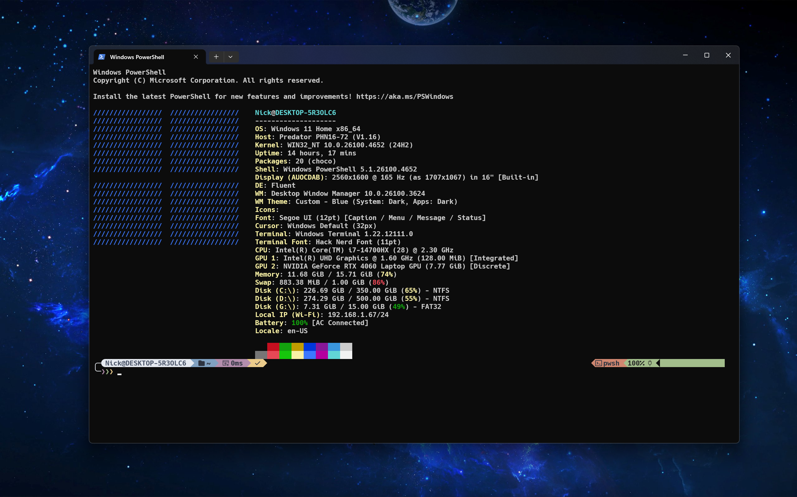

# 🚀 Nick Zoc's PowerShell Theme Manager

<div align="center">


**Transform your boring PowerShell terminal into a powerful, beautiful, and productive workspace!**

*The most stunning PowerShell theme setup you've ever seen* ✨

</div>

---

## 📸 **Screenshots**

<div align="center">


*Beautiful PowerShell terminal with Oh My Posh, Nord theme, and custom prompt*

</div>

---

## 🌟 **What Makes This Special**

<table>
<tr>
<td width="50%">

### 🎨 **Beautiful Aesthetics**
- **Nord Color Scheme** - Professional blue/teal palette
- **Oh My Posh Integration** - Powerline prompts with git status
- **Hack Nerd Font** - Programming icons and symbols
- **Custom ASCII Art** - Hacker-style animations

</td>
<td width="50%">

### ⚡ **Productivity Boost**
- **Smart Aliases** - `ll`, `grep`, `top`, `htop`, `fetch`
- **Fastfetch Integration** - Beautiful system information
- **Git Integration** - Branch status in prompt
- **Error-Safe Setup** - No breaking changes

</td>
</tr>
</table>

---

## 🚀 **Quick Installation**

### **Method 1: One-Line Install (Recommended)**
```powershell
iwr -useb "https://raw.githubusercontent.com/Nick-Zoc/My-Terminal-Setup/main/Terminal-Manager.ps1" | iex
```

### **Method 2: Manual Installation**
```powershell
# Clone the repository
git clone https://github.com/Nick-Zoc/My-Terminal-Setup.git
cd My-Terminal-Setup

# Run the PowerShell Theme Manager
.\Terminal-Manager.ps1
```

### **Method 3: Download ZIP**
1. Download the [latest release](https://github.com/Nick-Zoc/My-Terminal-Setup/archive/refs/heads/main.zip)
2. Extract to your desired location
3. Run `Terminal-Manager.ps1`

---

## 🎯 **Features Overview**

| Component | Description | Status |
|-----------|-------------|--------|
| **Oh My Posh** | Powerline prompt with themes | ✅ Auto-Install |
| **Fastfetch** | System information display | ✅ Auto-Install |
| **Hack Nerd Font** | Programming font with icons | ✅ Auto-Install |
| **Nord Theme** | Custom beautiful color scheme | ✅ Included |
| **PowerShell Profile** | Aliases and productivity functions | ✅ Configured |
| **Git Integration** | Branch status and git aliases | ✅ Built-in |

---

## 🛠️ **PowerShell Theme Manager Options**

<div align="center">

```
🎮 Choose your action:
┌─────────────────────────────────────────────────────────────┐
│  1. Install PowerShell Setup (Full Installation)           │
│     - Oh My Posh, Fastfetch, Hack Nerd Font                │
│     - Custom Nord theme & PowerShell profile               │
│     - Beautiful animated installation                      │
│                                                             │
│  2. Fix Profile Errors (Recommended for errors)            │
│     - Fixes 'command not found' errors                     │
│     - Keeps all customizations intact                      │
│     - Quick and safe solution                              │
│                                                             │
│  3. Complete Removal (Nuclear option)                      │
│     - Removes all terminal customizations                  │
│     - Uninstalls Oh My Posh, Fastfetch, etc.              │
│     - Returns to default PowerShell                        │
└─────────────────────────────────────────────────────────────┘
```

</div>

---

## 📁 **Project Structure**

```
My-Terminal-Setup/
├── 📄 README.md                    # This comprehensive guide
├── 🚀 Terminal-Manager.ps1         # Main PowerShell Theme Manager
├── 📂 Config/                      # Configuration files
│   ├── 📄 Microsoft.PowerShell_profile.ps1  # Custom PowerShell profile
│   └── 🎨 nordcustom.omp.json     # Beautiful Nord theme
├── 📂 Scripts/                     # Core installation scripts
│   ├── ⚙️ Setup-Terminal.ps1       # Full installation script
│   └── 🗑️ Revert-Terminal.ps1      # Uninstallation script
└── 📂 One-Line-Setups/            # Quick installation options
    ├── 📥 install.ps1              # Direct install script
    └── 🔧 revert.ps1               # Direct fix script
```

---

## 💻 **System Requirements**

<table>
<tr>
<td width="50%">

### **Required**
- ✅ **Windows 10/11** (PowerShell 5.1+)
- ✅ **Internet Connection** (for initial setup)
- ✅ **Administrator Rights** (for font installation)

</td>
<td width="50%">

### **Recommended**
- 🎯 **Windows Terminal** or **PowerShell 7+**
- 🎯 **Git for Windows** (auto-installed)
- 🎯 **Winget Package Manager** (built into Windows 11)

</td>
</tr>
</table>

---

## 🔧 **Detailed Installation Guide**

### **Step 1: Choose Your Installation Method**

<details>
<summary><strong>🚀 Method 1: One-Line Install (Easiest)</strong></summary>

1. **Open PowerShell as Administrator**
2. **Run the one-liner:**
   ```powershell
   iwr -useb "https://raw.githubusercontent.com/Nick-Zoc/My-Terminal-Setup/main/Terminal-Manager.ps1" | iex
   ```
3. **Follow the on-screen menu**
4. **Restart your terminal** when complete

</details>

<details>
<summary><strong>📦 Method 2: Git Clone (For Developers)</strong></summary>

1. **Open PowerShell/Terminal**
2. **Clone the repository:**
   ```powershell
   git clone https://github.com/Nick-Zoc/My-Terminal-Setup.git
   cd My-Terminal-Setup
   ```
3. **Run the manager:**
   ```powershell
   .\Terminal-Manager.ps1
   ```
4. **Select option 1** for full installation

</details>

<details>
<summary><strong>📁 Method 3: Manual Download</strong></summary>

1. **Download** the [ZIP file](https://github.com/Nick-Zoc/My-Terminal-Setup/archive/refs/heads/main.zip)
2. **Extract** to `C:\PowerShellTheme\` (or your preferred location)
3. **Open PowerShell** and navigate to the folder
4. **Run:** `.\Terminal-Manager.ps1`

</details>

### **Step 2: Installation Process**

The installer will automatically:

1. **🔍 Check System Requirements** - Verifies Windows version and permissions
2. **📦 Install Components** - Oh My Posh, Fastfetch, Hack Nerd Font
3. **🎨 Apply Theme** - Nord color scheme and custom prompt
4. **⚙️ Configure Profile** - Aliases and productivity functions
5. **✅ Verify Installation** - Ensures everything works correctly

---

## 🛠️ **Troubleshooting**

### **Common Issues & Solutions**

<details>
<summary><strong>❌ "Command not found" errors</strong></summary>

**Solution:** Run the PowerShell Theme Manager and select **Option 2 (Fix Profile Errors)**
```powershell
.\Terminal-Manager.ps1
# Choose option 2
```

</details>

<details>
<summary><strong>❌ Font not displaying correctly</strong></summary>

**Solution:** 
1. Install Hack Nerd Font manually from [Nerd Fonts](https://www.nerdfonts.com/font-downloads)
2. Set your terminal font to "Hack Nerd Font"
3. Restart your terminal

</details>

<details>
<summary><strong>❌ Oh My Posh not working</strong></summary>

**Solution:** 
```powershell
# Reinstall Oh My Posh
winget install JanDeDobbeleer.OhMyPosh
# Reload your profile
& $PROFILE
```

</details>

<details>
<summary><strong>❌ Colors look wrong</strong></summary>

**Solution:** 
1. Make sure you're using **Windows Terminal** or **PowerShell 7+**
2. Enable **true color support** in your terminal settings
3. Apply a dark theme to your terminal

</details>

---

## 🗑️ **Uninstallation Guide**

### **Complete Removal**
```powershell
# Method 1: Using the manager
.\Terminal-Manager.ps1
# Choose option 3

# Method 2: Manual cleanup
Remove-Item $PROFILE -Force  # Removes custom profile
winget uninstall JanDeDobbeleer.OhMyPosh  # Removes Oh My Posh
winget uninstall fastfetch  # Removes Fastfetch
```

### **Partial Removal (Keep some components)**
The PowerShell Theme Manager allows you to selectively remove components during the uninstallation process.

---

## 🎨 **Customization**

### **Available Aliases**
| Alias | Command | Description |
|-------|---------|-------------|
| `ll` | `Get-ChildItem -Force` | List all files (including hidden) |
| `..` | `cd ..` | Go up one directory |
| `grep` | `Select-String` | Search text in files |
| `top` | `Get-Process \| Sort-Object CPU -Desc` | Show top processes |
| `htop` | `Get-Process \| Sort-Object CPU -Desc` | Same as `top` |
| `fetch` | `fastfetch` | Show system information |

### **Modifying the Theme**
1. **Edit the theme file:** `Config/nordcustom.omp.json`
2. **Reload your profile:** `. $PROFILE`
3. **Or create your own theme** using [Oh My Posh documentation](https://ohmyposh.dev/)

### **Adding Custom Aliases**
Edit your PowerShell profile:
```powershell
notepad $PROFILE
# Add your custom functions and aliases
```

---

## 🤝 **Contributing**

We welcome contributions! Here's how you can help:

<table>
<tr>
<td width="50%">

### **🐛 Bug Reports**
- Use GitHub Issues
- Include system information
- Provide error messages
- Steps to reproduce

</td>
<td width="50%">

### **🚀 Feature Requests**
- Open a GitHub Issue
- Describe the feature
- Explain why it's useful
- Consider implementation

</td>
</tr>
</table>

### **Development Setup**
```powershell
# Fork and clone the repository
git clone https://github.com/your-username/My-Terminal-Setup.git
cd My-Terminal-Setup

# Make your changes
# Test thoroughly
# Submit a pull request
```

---

## 🙏 **Credits & Acknowledgments**

<div align="center">

### **Special Thanks**

</div>

<table>
<tr>
<td width="50%">

### **🎨 Themes & Design**
- **[Oh My Posh](https://ohmyposh.dev/)** - Prompt theme engine
- **[Nord Theme](https://www.nordtheme.com/)** - Beautiful color palette
- **[Hack Nerd Font](https://github.com/ryanoasis/nerd-fonts)** - Programming font with icons

</td>
<td width="50%">

### **🛠️ Tools & Utilities**
- **[Fastfetch](https://github.com/fastfetch-cli/fastfetch)** - System information tool
- **[PowerShell Community](https://github.com/PowerShell/PowerShell)** - Amazing shell platform
- **[Windows Terminal Team](https://github.com/microsoft/terminal)** - Modern terminal application

</td>
</tr>
</table>

### **👨‍💻 Created with ❤️ by**
- **Nick Zoc** - *Lead Developer & Designer*
- **AI Assistant** - *Code optimization & documentation*

---

## 📄 **License**

<div align="center">

**MIT License** - Feel free to use, modify, and distribute!

See the [LICENSE](LICENSE) file for details.

</div>

---

## 📊 **Project Stats**

<div align="center">


**If this project helped you, please consider giving it a ⭐!**

</div>

---

## 🚀 **What's Next?**

- [ ] **PowerShell 7+ Core Support** - Cross-platform compatibility
- [ ] **More Themes** - Additional color schemes and styles  
- [ ] **Plugin System** - Modular extensions and add-ons
- [ ] **Auto-Updates** - Keep your setup fresh automatically
- [ ] **Configuration GUI** - Easy visual customization
- [ ] **Profile Sync** - Backup and restore settings

---

<div align="center">

### **Ready to transform your PowerShell experience?**

```powershell
iwr -useb "https://raw.githubusercontent.com/Nick-Zoc/My-Terminal-Setup/main/Terminal-Manager.ps1" | iex
```

**Join thousands of developers who've already upgraded their terminals! 🚀**

---

*Made with ❤️ for the PowerShell community*

</div>


